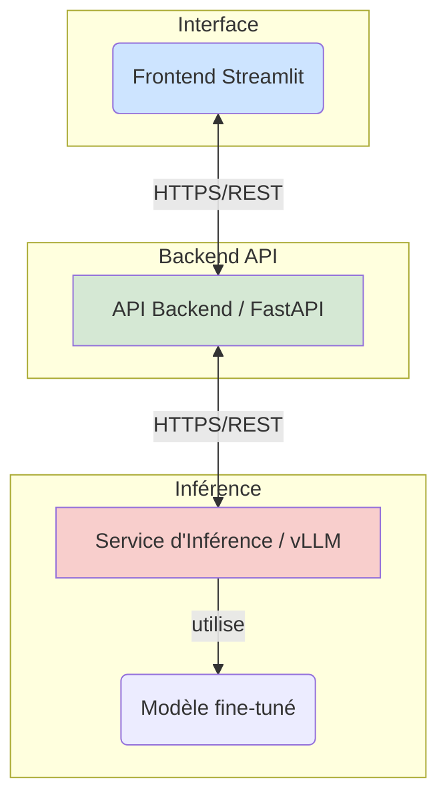

# Agent de Triage Hospitalier

## 🩺 Mission du Projet

Ce projet vise à développer un **Proof of Concept (POC)** pour un **agent d'IA de triage médical** destiné au Centre Hospitalier Saint-Aurélien (CHSA). L'objectif est de fournir une solution innovante pour assister le personnel soignant dans le triage initial des patients, afin de réduire les temps d'attente, d'optimiser la prise en charge et de garantir la conformité aux protocoles médicaux.

### Objectifs Clés :
-   **Collecte de Symptômes** : Interagir avec les patients via un questionnaire intelligent et adaptatif.
-   **Évaluation de Priorité** : Déterminer le niveau d'urgence (maximale, modérée, différée) selon les protocoles médicaux.
-   **Recommandations Claires** : Fournir des explications et des orientations précises aux patients.
-   **Conformité RGPD** : Assurer l'anonymisation des données sensibles et la traçabilité des interactions.

## 🚀 Architecture Technique

Le système est conçu sur une architecture microservices découplée pour garantir scalabilité, résilience et maintenance.



-   **Frontend UI (Streamlit)** : Interface utilisateur interactive pour les professionnels de santé.
-   **API Gateway (FastAPI)** : Point d'entrée principal, gère la logique métier, l'anonymisation (via Presidio), l'audit et la communication avec le service d'inférence.
-   **Inference Service (vLLM)** : Service optimisé pour l'exécution rapide du modèle de langage (LLM) sur GPU.

## 🧠 Modèle et Stratégie d'Entraînement

-   **Modèle de Base** : `Qwen/Qwen3-1.7B-Base`, un modèle compact mais performant.
-   **Fine-Tuning Supervisé (SFT)** : Utilisation de la technique **LoRA** pour spécialiser le modèle sur un corpus médical bilingue.
-   **Alignement par Préférences (DPO)** : Affinage du comportement du modèle pour qu'il corresponde aux pratiques cliniques validées, en utilisant des paires de réponses préférées.
-   **Patch `rope_theta`** : Un script (`injecter_rope_theta.py`) est utilisé pour injecter le paramètre `rope_theta` (valeur `1000000.0`) nécessaire à la compatibilité du modèle Qwen avec certains frameworks d'inférence.

## 📊 Métriques de Performance (POC)

| Métrique                               | Valeur Actuelle | Méthode de vérification |
| :------------------------------------- | :-------------- | :---------------------- |
| **Perte de Validation (DPO)**          | `1.837`         | `evaluate_dpo.py`       |
| **Précision Linguistique (SFT)**       | `96.00%`        | `quantitative_matrix.py`|
| **Précision Triage (Mots-clés) (SFT)** | `88.00%`        | `quantitative_matrix.py`|
| **Taux de Sécurité (Sans Hallucination) (SFT)** | `100.00%`       | `quantitative_matrix.py`|
| **Latence API Gateway**                | `~0.0 ms` (local) | Logs d'audit            |
| **Anonymisation PII**                  | À valider       | Tests `test_audit.py`   |

## 🚀 Déploiement et Opérations

Le déploiement est entièrement automatisé via **Google Cloud Build** (CI/CD) pour chaque service :
-   **API Gateway** : Déployé sur Cloud Run (1 vCPU, 4Gi RAM).
-   **Inference Service** : Déployé sur Cloud Run (6 vCPU, 24Gi RAM, 1 GPU NVIDIA L4) avec ingress interne.
-   **Frontend UI** : Déployé sur Cloud Run.

Un script `orchestrator.py` permet de gérer les déploiements et de générer un aperçu technique (`TECHNICAL_OVERVIEW.md`).

## 🛠️ Démarrage Rapide (Local)

Pour lancer l'ensemble de l'architecture en local avec Docker Compose (nécessite `nvidia-docker` pour le service d'inférence) :

```bash
docker-compose up --build
```

Accédez à l'interface Streamlit via `http://localhost:8501`.

## Pipeline CI/CD

Le pipeline est configuré pour exécuter des tests de qualité (linting, formatage) et déployer les services sur Google Cloud Run.
