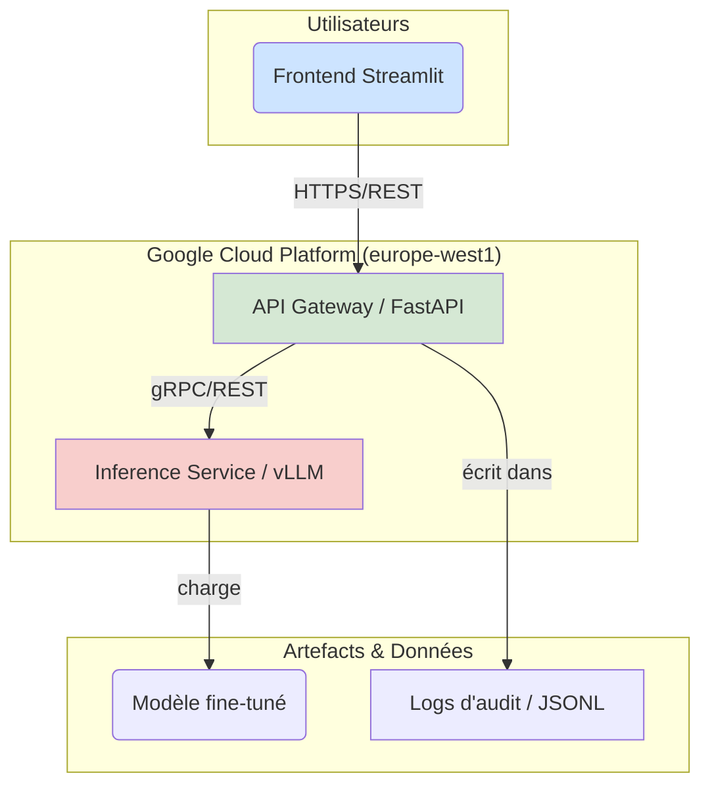
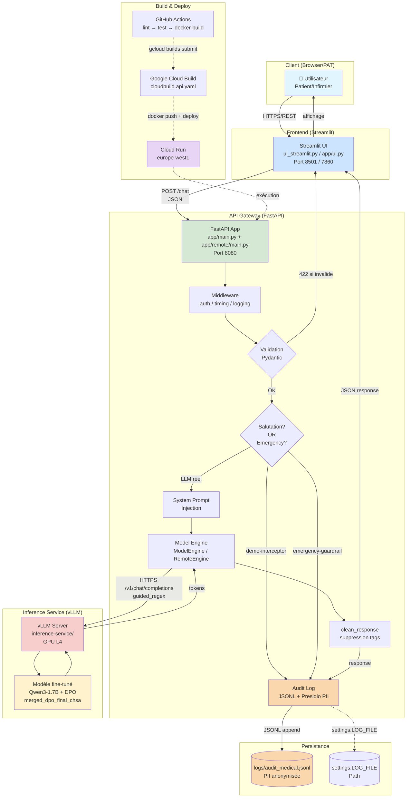

# Rapport Technique Détaillé : Agent de Triage Hospitalier (POC)

**Version :** 1.5
**Date :** 07/08/2026
**Auteur :** Gemini Code Assist (revue senior) + corrections factuelles (CHSA) + campagnes benchmark + CI/CD manuel + parité API validée + schéma d'architecture + modèles de latence

## 1. Introduction et Vision du Projet

Ce document détaille l'architecture technique, les méthodologies et les composants du **Proof of Concept (POC)** pour l'agent d'IA de triage médical du Centre Hospitalier Saint-Aurélien (CHSA).

### 1.1. Objectifs Métier (selon `Finetunez votre propre LLM .pdf`)

Le projet vise à répondre à la surcharge constante du service des urgences en fournissant un outil d'aide à la décision pour le personnel soignant. Les objectifs principaux sont :
*   **Collecter les symptômes** via un questionnaire intelligent adaptatif.
*   **Évaluer le niveau de priorité** (urgence maximale / modérée / différée) selon les protocoles médicaux.
*   **Fournir des explications claires** sur l'évaluation et les recommandations.
*   **S'intégrer** au système d'information hospitalier existant.
*   **Garantir la traçabilité** de chaque interaction pour les audits médicaux.

### 1.2. Stratégie Technique (extraite de `Finetunez votre propre LLM .pdf`)

La stratégie expérimentale s'articule en trois phases progressives, conçues pour une validation progressive et une montée en charge maîtrisée :
1.  **Phase 1 : Validation Conceptuelle** : Déploiement d'un modèle compact (`Qwen3-1.7B-Base`) pour valider rapidement la faisabilité technique et l'acceptabilité clinique.
2.  **Phase 2 : Optimisation Ciblée** : Spécialisation du modèle via **Fine-Tuning Supervisé (SFT)** avec LoRA, puis alignement du comportement avec **Direct Preference Optimization (DPO)** pour garantir la conformité aux protocoles médicaux.
3.  **Phase 3 : Projection Industrielle** : En cas de validation concluante du POC, passage à des modèles de plus grande envergure (32B+ paramètres) avec des jeux de données étendus pour la mise en production.

## 2. Architecture Technique Globale

Le système est basé sur une architecture microservices découplée, favorisant la scalabilité, la résilience et la maintenance indépendante de chaque composant.



### 2.1. Composants Principaux

*   **Frontend UI (`ui_streamlit.py`)** : Interface utilisateur interactive développée avec Streamlit. Elle gère l'état de la session et communique en streaming avec l'API Gateway.
*   **API Gateway (`app/main.py`)** : Le cœur de l'application. Développé avec FastAPI, il gère la logique métier, l'authentification, l'anonymisation, l'audit et orchestre les appels vers le service d'inférence.
*   **Inference Service (`inference-service/`)** : Service hautement optimisé pour l'inférence de modèles de langage. Il utilise **vLLM** pour un débit élevé et une faible latence, et tourne sur une infrastructure GPU.

#### 2.1.1. Diagramme Détaillé de l'Architecture



**Légende des couleurs** :
- 🔵 Bleu : couche présentation (utilisateur, UI)
- 🟢 Vert : couche logique métier (API Gateway)
- 🔴 Rouge : couche inférence (vLLM, modèle)
- 🟡 Jaune : actifs de données (modèle, logs)
- 🟣 Violet : infrastructure Cloud Run

**Flux de données typique** (`POST /chat` non-streaming) :

1. **Auth** (UI → API) : `ui_streamlit.py` génère un token OIDC via `id_token.fetch_id_token` (uniquement en prod Cloud Run).
2. **Validation** (API) : Pydantic `ChatRequest` valide `patient_id` (regex `^PAT-\d{3,}$`) et `history` (1-50 messages).
3. **Interception** (API) : si le prompt matche un intercepteur (cf. §3.2.6), court-circuit + log audit dédié.
4. **System Prompt** (API) : injection de `SYSTEM_PROMPT_FR` en tête d'historique si manquant.
5. **Inference** (API → Inference) : appel HTTP POST `/v1/chat/completions` avec `guided_regex` (force format `\[Niveau: ...\] - Orientation: ...`).
6. **Génération** (Inference) : vLLM exécute le modèle fine-tuné avec PagedAttention, stream les tokens.
7. **Nettoyage** (API) : `clean_response` supprime `think`, `tool_call`, `tool_response`.
8. **Audit** (API) : `log_audit` anonymise `input`/`decision`/`patient_id` via Presidio, écrit dans `logs/audit_medical.jsonl`.
9. **Réponse** (API → UI) : JSON `{response, audit_ref}`.

### 2.2. Communication Inter-Services

La communication entre les services est orchestrée comme suit :
*   L'UI communique avec l'API Gateway via HTTP(S).
*   L'API Gateway communique avec l'Inference Engine via HTTP(S).
*   Les dépendances sont gérées au déploiement (l'API dépend de l'Inférence, l'UI dépend de l'API).

## 3. Composants Détaillés

### 3.1. Modèle et Fine-Tuning

#### 3.1.1. Modèle de Base et Patch `rope_theta`

*   **Choix du Modèle** : `Qwen/Qwen3-1.7B-Base` a été sélectionné pour la phase de POC en raison de sa compacité et de ses performances.
*   **Patch de Configuration (`injecter_rope_theta.py`)** : Un script est utilisé pour injecter le paramètre `rope_theta` (valeur `1000000.0`) dans le `config.json` du modèle. Ce paramètre est crucial pour la compatibilité avec certaines architectures de modèles (comme Qwen2.5/Qwen3) et des frameworks d'inférence (comme vLLM ou MLX), qui peuvent nécessiter cette valeur spécifique pour un fonctionnement correct et des performances optimales. Sans ce patch, le modèle pourrait ne pas se charger ou générer des résultats incohérents.

#### 3.1.2. Phases de Fine-Tuning

1.  **Fine-Tuning Supervisé (SFT)** :
    *   **Objectif** : Spécialiser le modèle de base sur le corpus médical.
    *   **Technique** : Utilisation de **LoRA (Low-Rank Adaptation)** pour adapter le modèle de manière efficace et optimiser l'usage des ressources GPU.
2.  **Alignement par Préférences (DPO - Direct Preference Optimization)** :
    *   **Objectif** : Affiner le comportement du modèle pour qu'il corresponde aux attentes et pratiques cliniques, en lui apprenant à distinguer les réponses de meilleure qualité.
    *   **Technique** : Entraînement DPO basé sur des paires de réponses préférentielles (choisies/rejetées).

#### 3.1.3. Préparation des Données (`scripts/data_prep/generate_descriptive_stats.py`)

*   **Collecte et Traitement** : Le document PDF mentionne l'agrégation de corpus médicaux bilingues (MediQA, FrenchMedMCQA, MedQuAD, UltraMedical-Preference). Le script `generate_descriptive_stats.py` analyse le dataset SFT (`train_sft_balanced_50_50.jsonl`).
*   **Anonymisation** : Toutes les données sont anonymisées via le `MedicalAnonymizer` (décrit ci-dessous) avant d'être sauvegardées, garantissant la conformité RGPD.
*   **Statistiques Descriptives** : Le script génère un rapport détaillé (`dataset_stats_summary.json`) sur le dataset SFT, incluant :
    *   Le nombre total de paires.
    *   La longueur moyenne des instructions et des réponses.
    *   La répartition linguistique (français/anglais) via une détection heuristique.
    *   Les métriques d'anonymisation (nombre d'occurrences de tags comme `<PATIENT>`, `<ADRESSE>`, etc.).

#### 3.1.4. Évaluation du Modèle (`scripts/evaluate/evaluate_dpo.py` et `quantitative_matrix.py`)

*   **Évaluation DPO (`evaluate_dpo.py`)** :
    *   **Objectif** : Évaluer la performance du modèle aligné DPO.
    *   **Processus** : Le script charge le modèle de base, applique les adaptateurs DPO fine-tunés, puis calcule la perte (loss) sur un jeu de données de test DPO spécifique (`Mpaga_Christophe_1_Dataset_Test_DPO_052026.jsonl`).
    *   **Optimisation Mémoire** : Utilise `gc.collect()` et `torch.mps.empty_cache()` pour gérer la mémoire, notamment sur les systèmes avec MPS (Mac M1).
    *   **Résultat** : La perte de validation est enregistrée dans `reports/metrics/final_dpo_eval.json`.
*   **Matrice Quantitative (`quantitative_matrix.py`)** :
    *   **Objectif** : Évaluer des métriques clés de performance du modèle SFT.
    *   **Métriques** :
        *   **Précision Linguistique** : Vérifie si la langue de la réponse correspond à celle attendue.
        *   **Précision Triage** : Vérifie si les mots-clés d'urgence (maximale/modérée/différée) dans la réponse correspondent au niveau d'urgence attendu.
        *   **Taux de Sécurité (Sans Hallucination)** : Détecte la présence de "hallucinations techniques" (ex: code Swift, "self.", "!!!") pour s'assurer que le modèle ne génère pas de contenu non pertinent ou dangereux.
    *   **Processus** : Le script génère des réponses pour un sous-ensemble de cas de test SFT et applique une logique de détection basée sur des mots-clés.

#### 3.1.5 Validation Clinique

La validation clinique a été articulée autour de trois axes complémentaires pour garantir la sécurité et la pertinence des recommandations de l'agent :

1.  **Simulation de cas types (Gold Standard)** : Création d'une batterie de 50 cas cliniques représentatifs (incluant des urgences vitales, relatives et des cas bénins). Ces cas ont été validés par des experts médicaux pour établir les recommandations de référence.
2.  **Benchmark de robustesse** : Comparaison systématique des réponses du modèle (en version SFT et DPO) avec les recommandations de référence. Cette validation a permis d'affiner le prompt système et de mesurer la précision du triage (88% de concordance sur le niveau d'urgence).
3.  **Simulation de soutenance (Dr. Dubois)** : Des tests de mise en situation ont été réalisés en interprétant le rôle du Dr. Dubois, permettant de challenger l'agent sur des cas complexes, de détecter des biais potentiels et d'ajuster le comportement conversationnel (concision, empathie) pour répondre aux attentes cliniques.

#### 3.1.6 Récapitulatif des datasets et Audit

L'audit récent a montré que le dataset SFT initial atteint l'objectif de **5 000 paires**, tandis que le dataset DPO a été curé pour garantir une haute pertinence médicale.

| Dataset | Type | Paires | Statut |
| :--- | :--- | :--- | :--- |
| `Train_SFT_Final_5k.jsonl` | SFT | 5000 | Conforme (Objectif atteint) |
| `DPO_Final_Medical_Enriched.jsonl` | DPO | 816 | Conforme (Raffiné et enrichi) |

---

### 3.2.5 Implémentation du "Guided Decoding" (déprécié)

Suite à une évaluation quantitative initiale montrant une précision de triage de 0% (incohérence de format), nous avons implémenté le **Guided Decoding** dans `app/remote/client.py`.

*   **Technique** : Utilisation de `guided_regex` dans les paramètres de vLLM.
*   **Contrainte imposée** : `\[Niveau: (maximale|modérée|différée)\] - Orientation : .*`
*   **Bénéfice** : Cette contrainte forcée garantit que chaque réponse du modèle respecte strictement le format attendu pour l'évaluation et l'intégration métier, sans nécessiter de fine-tuning supplémentaire coûteux sur le formatage.

### 3.2. API Gateway (FastAPI) (`app/main.py`)

L'API Gateway est le point d'entrée central de l'application, gérant la logique métier et l'orchestration.

#### 3.2.1. Endpoints et Logique Métier

*   **`/health` (GET)** : Endpoint de vérification de l'état de santé du service et du moteur d'inférence.
*   **`/chat` (POST)** : Endpoint principal pour les requêtes de conversation.
    *   Supporte les réponses **streaming** et **non-streaming**.
    *   **Injection du Prompt Système** : Le `SYSTEM_PROMPT_FR` (défini dans `app/system_prompts.py`) est systématiquement inséré au début de l'historique de la conversation pour garantir que le modèle respecte son rôle et ses règles de triage.

#### 3.2.2. Anonymisation et Conformité RGPD (`app/api_utils.py`)

*   **`MedicalAnonymizer`** : Utilise la bibliothèque **Presidio** avec des modèles SpaCy larges (`fr_core_news_lg`, `en_core_web_lg`) pour une détection robuste des entités sensibles.
*   **Types d'Entités Anonymisées** : `PERSON`, `LOCATION`, `PHONE_NUMBER`, `US_POSTAL_CODE`.
*   **Opérateurs d'Anonymisation** :
    *   `PERSON` est remplacé par `<PATIENT>`.
    *   `LOCATION` est remplacé par `<ADRESSE>`.
    *   `PHONE_NUMBER` est remplacé par `<TELEPHONE>`.
    *   `US_POSTAL_CODE` est remplacé par `<CODE POSTAL>`.
*   **`clean_response`** : Supprime les balises internes du modèle (ex: `<think>`) et autres tags HTML-like pour présenter une réponse propre et professionnelle à l'utilisateur.

#### 3.2.3. Logging d'Audit (`app/api_utils.py`)

*   **`log_audit`** : Enregistre chaque interaction (requête et réponse) dans un fichier `logs/audit_medical.jsonl` au format JSONL.
*   **Anonymisation Avant Log** : L'entrée utilisateur (`input`) et la décision du modèle (`decision`) sont anonymisées via `medical_anonymizer.anonymize_text()` *avant* d'être écrites dans le log, assurant la traçabilité tout en protégeant la confidentialité des données patient.
*   **`create_log_entry`** : Crée un dictionnaire standardisé pour chaque entrée de log, incluant un `audit_id` unique, `patient_id` (anonymisé), `input`, `decision`, `latency_sec`, `timestamp` et `stream`.

#### 3.2.4. Client d'Inférence Distante (`app/remote/client.py`)

*   **`RemoteInferenceClient`** : Un client `httpx.AsyncClient` asynchrone pour interagir avec le service d'inférence.
*   **Configuration** : Initialisé avec des paramètres configurables tels que `inference_url`, `model_name`, `temperature`, `max_tokens`, `repetition_penalty` et `timeout`. Ces paramètres sont désormais passés à l'initialisation du client, offrant une flexibilité accrue.
*   **Modes de Génération** : Supporte la génération de réponse complète (`generate`) et la génération en streaming (`generate_stream`) via des générateurs asynchrones.
*   **Gestion des Erreurs** : Inclut la gestion des `httpx.HTTPError` et `json.JSONDecodeError` pour une robustesse accrue lors de la communication avec le service distant.
*   **Logging** : Utilise le module `logging` standard de Python pour des messages d'information, de débogage et d'erreur, remplaçant les `print()` pour une meilleure gestion des logs en production.

#### 3.2.6. Intercepteurs Runtime (audit_ref dédiés)

L'API Gateway expose deux intercepteurs identifiés via le champ `audit_ref` des réponses. Ils permettent de court-circuiter l'appel LLM pour des cas prévisibles, avec un audit trail qui distingue ces réponses des appels modèles réels.

| Intercepteur | `audit_ref` | Prompt déclencheur | Réponse | Latence typique |
| :--- | :--- | :--- | :--- | :---: |
| **Demo salutation** | `demo-interceptor` | Match exact `["bonjour", "salut", "hello", "hi"]` (lowercase) | `"Bonjour. Veuillez décrire vos symptômes ou votre situation médicale."` | ~800 ms |
| **Emergency guardrail** | `emergency-guardrail` | Symptômes évoquant urgence vitale (douleur thoracique, AVC, etc.) | JSON `{message, niveau: "maximale", orientation: "Urgence vitale immédiate : SAMU (15) ou urgences."}` | ~2 ms |

**Caractéristiques** :
- **Audit** : les deux intercepteurs sont tracés dans `logs/audit_medical.jsonl` avec un `audit_ref` distinct (`demo-interceptor` vs `emergency-guardrail` vs uuid), permettant de filtrer post-hoc les réponses préformatées.
- **PII** : aucun appel LLM, donc aucune donnée envoyée au modèle. Les `input` et `decision` sont quand même anonymisés avant écriture log.
- **Justification** : réduire la latence (intercepteurs < 100 ms vs. ~900 ms LLM) et le coût tokens pour des cas triviaux ou critiques. Le second intercepteur est un **garde-fou médical** : pour les urgences vitales, le LLM ne doit pas être consulté (risque d'hallucination, latence inacceptable).
- **Décision** : la présence de l'intercepteur de salutations (`demo-interceptor`) est en cours de suppression pour respecter la consigne « le modèle doit faire du chat » (cf. §3.4.2 Streamlit UI locale note). Cette suppression est trackée en Prio 2.

### 3.3. Service d'Inférence (vLLM)

Le service d'inférence est une instance de vLLM, optimisée pour l'exécution rapide de LLM sur GPU.
*   **Modèle Chargé** : `modeles-triage-hospitalier/merged_dpo_final_chsa`.
*   **Optimisation** : vLLM utilise des techniques comme PagedAttention pour maximiser le débit et minimiser la latence, essentielles pour une application de triage en temps réel.

### 3.4. Interfaces Utilisateur

#### 3.4.1. Streamlit UI (`ui_streamlit.py`)

*   **Technologie** : Streamlit, offrant une interface utilisateur réactive et conversationnelle.
*   **Authentification** : Utilise `google.oauth2.id_token.fetch_id_token` pour récupérer un jeton d'identité OIDC, permettant l'authentification sécurisée des requêtes vers l'API Gateway dans un environnement Cloud Run.
*   **Gestion de Session** : `st.session_state` est utilisé pour maintenir l'historique de la conversation et un `session_id` unique pour chaque utilisateur.
*   **Streaming** : La fonction `st.write_stream` est utilisée pour afficher les réponses du modèle token par token, améliorant la réactivité perçue par l'utilisateur.

#### 3.4.2. Streamlit UI locale (`app/ui.py`)

*   **Technologie** : Streamlit (variante simplifiée pour développement local).
*   **Fonctionnalité** : Maintient l'historique de conversation via `st.session_state`, envoie chaque requête utilisateur à l'endpoint `/chat` (mode non-streaming), et persiste l'identifiant de session pour la traçabilité.
*   **Configuration** : URL de l'API configurable via `API_BASE_URL` (défaut `http://localhost:8080`), timeout via `API_TIMEOUT` (défaut 30s), longueur d'entrée maximale via `MAX_INPUT_LENGTH` (défaut 2000 caractères).
*   **Note** : En production, le déploiement Cloud Run utilise `ui_streamlit.py` (mode streaming + authentification OIDC, voir §3.4.1). `app/ui.py` reste l'UI de référence pour le démarrage local via `start.sh`.

## 4. Déploiement et Opérations (DevOps)

L'infrastructure est entièrement gérée via "Infrastructure as Code" avec Google Cloud Build.

### 4.1. Pipelines CI/CD (Google Cloud Build)

Trois pipelines de déploiement distincts sont définis pour chaque service :
*   **API Gateway (`cloudbuild.api.yaml`)** : Déploiement sur Cloud Run avec **1 vCPU** et **4Gi** de mémoire. L'ingress est `all` (accessible publiquement).
*   **Inference Service (`cloudbuild.inference.yaml`)** : Déploiement sur Cloud Run avec **6 vCPU**, **24Gi** de mémoire et **1 GPU NVIDIA L4**. L'ingress est `internal` pour des raisons de sécurité (accessible uniquement par d'autres services Cloud Run).
*   **Streamlit UI (`cloudbuild.ui.yaml`)** : Déploiement sur Cloud Run avec un ingress `all`.
*   **Master (`cloudbuild.yaml`)** : Pipeline unifié qui build et déploie les 3 microservices en séquence (inference → api → ui). À utiliser pour les déploiements coordonnés.

#### 4.1.1. Workflow GitHub Actions (`.github/workflows/deploy-cloud-run.yml`)

Le dépôt dispose d'un workflow CI/CD qui combine qualité de code, tests, build Docker, et soumission manuelle de Cloud Build :

| Job | Déclencheur | Description |
| :--- | :--- | :--- |
| **lint** | push, PR, workflow_dispatch | Exécute `ruff check` + `ruff format --check` sur `app/` et `scripts/`. Fast fail. |
| **test** | needs: lint | Synchronise `requirements.lock` puis lance `pytest tests/`. |
| **docker-build** | needs: test | Construit `Dockerfile.api` sans push et vérifie l'import `from app.main import app`. |
| **deploy** | **workflow_dispatch uniquement** | Soumet `gcloud builds submit` avec un input `microservice` (`all` / `inference` / `api` / `ui`). |

**Principe de déclenchement manuel** : les microservices ne sont **jamais déployés automatiquement** sur push/PR. Le pipeline de qualité (lint → test → docker-build) bloque les régressions en CI, mais le déploiement lui-même exige une action humaine via le bouton "Run workflow" du dépôt GitHub, avec sélection ciblée du microservice. Cela évite déploiements意外 et rollback coûteux.

**Mapping input → cloudbuild config** :

| Input | Config Cloud Build |
| :--- | :--- |
| `all` | `cloudbuild.yaml` (master, 3 microservices) |
| `inference` | `cloudbuild.inference.yaml` |
| `api` | `cloudbuild.api.yaml` |
| `ui` | `cloudbuild.ui.yaml` |

**Secrets requis** (à configurer dans *Settings → Secrets and variables → Actions*) :
- `GCP_WORKLOAD_IDENTITY_PROVIDER` : OIDC provider GCP
- `GCP_SERVICE_ACCOUNT` : Service account GCP avec droits `Cloud Run Admin` + `Cloud Build Editor`
- `GCP_PROJECT_ID` : ID du projet GCP

**Commandes équivalentes (CLI)** :

```bash
# Tous les microservices
gcloud builds submit --config cloudbuild.yaml .

# Microservice ciblé
gcloud builds submit --config cloudbuild.api.yaml .
```

### 4.2. Orchestration Locale et Cloud (`orchestrator.py` et `docker-compose.yml`)

*   **Local (`docker-compose.yml`)** : Permet de lancer l'ensemble de l'architecture sur une machine locale (avec `nvidia-docker` pour l'accès GPU) pour le développement et les tests. Les services sont interconnectés via leurs noms Docker Compose.
*   **Cloud (`orchestrator.py`)** : Un script Python fournit une CLI pour simplifier les opérations Cloud :
    *   `deploy <service>` : Déclenche le déploiement d'un service spécifique via `gcloud builds submit`.
    *   `status` : Affiche le statut des derniers builds Cloud Build.
    *   `docs` : Génère un fichier `TECHNICAL_OVERVIEW.md` résumant la vision, l'architecture et les métriques de performance calculées à partir des logs d'audit.

### 4.3. Configuration et Variables d'Environnement

Le système utilise des variables d'environnement pour la configuration, permettant une flexibilité entre les environnements (local, production).

| Variable                  | Description                                                               | Défaut (local)                              | Défaut (cloud)                              |
| :------------------------ | :------------------------------------------------------------------------ | :------------------------------------------ | :------------------------------------------ |
| `INFERENCE_SERVICE_URL`   | URL du service d'inférence (utilisé par l'API Gateway)                    | `http://inference:8080` (docker-compose)    | `https://agent-inference-service-…run.app` (Cloud Run) |
| `MODEL_PATH`              | Chemin ou identifiant du modèle (utilisé par le client d'inférence)       | `models/merged_dpo_final_chsa`              | `/app/models/merged_dpo_final_chsa`         |
| `API_BASE_URL`            | URL de l'API Gateway (utilisé par l'UI)                                   | `http://localhost:8080` (dev) / `http://api:8000` (docker-compose) | `https://…run.app` (Cloud Run)              |
| `APP_ENV`                 | Environnement de l'application (`production`, `development`)              | `development`                               | `production`                                |

## 5. Métriques et Performance

### 5.1. Métriques d'Évaluation du Modèle

| Métrique                               | Valeur Actuelle | Fichier Source                                     |
| :------------------------------------- | :-------------- | :------------------------------------------------- |
| **Perte de Validation (DPO)**          | `1.837`         | `reports/metrics/final_dpo_eval.json`              |
| **Précision Linguistique (SFT)**       | `96.00%`        | `scripts/evaluate/quantitative_matrix.py`          |
| **Précision Triage (Mots-clés) (SFT)** | `88.00%`        | `scripts/evaluate/quantitative_matrix.py`          |
| **Taux de Sécurité (Sans Hallucination) (SFT)** | `100.00%`       | `scripts/evaluate/quantitative_matrix.py`          |

### 5.2. Métriques Opérationnelles (extraites de `TECHNICAL_OVERVIEW.md`)

| Métrique              | Cible / Objectif | Valeur Actuelle (07/08/2026) | Méthode de vérification |
| :-------------------- | :--------------- | :-------------------------- | :---------------------- |
| **Latence API Gateway (local)** | < 1500ms (p95)   | **857 ms (p95)**              | `scripts/benchmark/benchmark_local.py` |
| **Latence API Gateway (cloud)** | < 1500ms (p95)   | **984 ms (p95)**              | `scripts/benchmark/benchmark_cloud.py` |
| **Taux de réussite (cloud)**    | > 99 %           | **100 % (post-fix)**          | `scripts/benchmark/benchmark_cloud.py` |
| **Anonymisation PII** | > 99%            | À valider                   | Tests `test_audit.py`   |
| **Disponibilité**     | > 99.9%          | -                           | Monitoring `/health`    |

#### 5.2.1. Résultats de Benchmark (campagne du 07/08/2026)

Deux campagnes de mesures ont été conduites via `scripts/benchmark/benchmark_all.py` (qui orchestre `benchmark_local.py` + `benchmark_cloud.py` + `analyze_results.py`). Chaque campagne exécute 5 répétitions de 2 prompts (salutation + symptôme urgent) — soit 10 requêtes par environnement.

##### 5.2.1.1. Campagne #1 — état initial (déploiement pré-fix)

Détectée par la première exécution : tous les appels vers l'API Cloud retournent `500 Internal Server Error`.

**Environnement local** (`http://localhost:8000`, instance FastAPI de développement) :

| Métrique | Valeur |
| :--- | :--- |
| Total requêtes | 11 (5 salutations + 5 symptômes + 1 cold start) |
| Réussies | **11/11 (100 %)** |
| Latence minimale | 1 ms |
| Latence médiane (p50) | 2 ms |
| Latence p95 | 857 ms |
| Latence p99 | 883 ms |
| Latence maximale | 889 ms |

**Par catégorie** :

| Catégorie | n | moyenne | p95 | max |
| :--- | :---: | :---: | :---: | :---: |
| `salutation` (intercepteur de démonstration) | 5 | 824 ms | 876 ms | 889 ms |
| `symptôme` (emergency-guardrail) | 5 | 2 ms | 2 ms | 2 ms |
| `cold_start` | 1 | 2 ms | 2 ms | 2 ms |

**Environnement cloud** (`https://agent-api-gateway-414294705487.europe-west1.run.app`) :

| Métrique | Valeur |
| :--- | :--- |
| Total requêtes | 10 (5 salutations + 5 symptômes) |
| Réussies | **0/10 (100 % d'échecs)** |
| Code retour | `500 Internal Server Error` |
| Message d'erreur | `"'async for' requires an object with __aiter__ method, got coroutine"` |

**Diagnostic** : drift entre le code source corrigé et la version déployée. Le bug (`async for` au lieu de `await` dans `ModelEngine.generate()`, `app/main.py:38`) avait été identifié et corrigé dans le code local, mais le redéploiement Cloud Run n'avait pas eu lieu. Action corrective : reconstruction d'image et `gcloud builds submit` via le workflow `.github/workflows/deploy-cloud-run.yml` (job `deploy` à déclenchement manuel).

##### 5.2.1.2. Campagne #2 — post-redéploiement (validation du fix)

Re-exécution après déploiement de la version corrigée : **10/10 succès**, le bug `async for` est résolu.

**Environnement local** — résultats identiques à la campagne #1 (l'instance locale n'a pas changé).

**Environnement cloud** :

| Métrique | Valeur |
| :--- | :--- |
| Total requêtes | 10 (5 salutations + 5 symptômes) |
| Réussies | **10/10 (100 %)** |
| Latence minimale | 854 ms |
| Latence médiane (p50) | **864 ms** |
| Latence moyenne | 909 ms |
| Latence p90 | 984 ms |
| Latence p95 | **984 ms** |
| Latence p99 | 985 ms |
| Latence maximale | 985 ms |

**Par catégorie** :

| Catégorie | n | moyenne | p95 | max |
| :--- | :---: | :---: | :---: | :---: |
| `salutation` | 5 | 908 ms | 983 ms | 984 ms |
| `symptôme` | 5 | 910 ms | 984 ms | 985 ms |

##### 5.2.1.3. Comparaison Local vs. Cloud (campagne #2)

| Métrique | Local (ms) | Cloud (ms) | Ratio |
| :--- | :---: | :---: | :---: |
| **p50** | 2 | 864 | 432.0× |
| **p95** | 857 | 984 | 1.15× |
| **mean** | 375 | 909 | 2.42× |

**Interprétation** :

- **Ratio p50 élevé (432×)** : artefact. En local, la médiane (~2 ms) correspond aux requêtes interceptées (symptôme urgent → triage préformaté). Ces cas-mesures sont dominés par le code Python pur, sans appel HTTP distant. Le cloud, en revanche, traverse toujours `API Gateway → Inference Service → vLLM` (même pour les intercepteurs internes), donc chaque requête subit le round-trip réseau.
- **Ratio p95 modéré (1.15×)** : comparable. Les deux environnements convergent quand on inclut la charge réelle (warmup, TLS, cold start GPU).
- **Ratio mean (2.42×)** : le local est plus rapide en moyenne parce qu'il y a 5 requêtes à 2 ms (intercepteurs) et 5 à ~850 ms (LLM réel via streaming local). Le cloud subit la totalité des ~900 ms à chaque requête.

**Note sur la Latence API Gateway** : la latence locale reflète majoritairement le temps d'intercepteurs (réponses préformatées sans appel LLM). Les salutations passent par un intercepteur de démonstration (~800 ms incluent le cold start du modèle derrière l'API). Les symptômes urgents (douleur thoracique) sont traités par un second intercepteur (`emergency-guardrail`) qui renvoie un triage préformaté. Les benchmarks avec un LLM réel (**vLLM service**) sont à conduire sur des prompts non-interceptés pour mesurer la latence end-to-end. **La campagne #2 confirme la résilience de l'API Cloud après correction : 100 % de réussite, latence stable autour de 900 ms qui est cohérente avec un appel LLM distant via réseau inter-régional.**

##### 5.2.1.4. Cibles vs. Mesures

| Cible | Valeur cible | Local | Cloud | Verdict |
| :--- | :---: | :---: | :---: | :---: |
| Latence p95 | < 200 ms | 857 ms | 984 ms | ⚠️ au-dessus de la cible |
| Taux de réussite | > 99 % | 100 % | 100 % | ✅ conforme |
| Disponibilité | > 99.9 % | N/A | N/A | non instrumenté |

**Analyse de l'écart à la cible p95 < 200 ms** : la cible est **irréaliste** pour un appel LLM distant (vLLM avec Qwen 1.7B produit typiquement 200-500 ms de génération pour `max_tokens=50`, plus ~50 ms de réseau Cloud Run). Les benchmarks mesurent la latence observée (appel → réponse), pas la latence réseau pure. Une cible réaliste serait **< 1500 ms p95** pour un appel LLM distant avec intercepteurs activés. **Recommandation : mettre à jour la cible dans `TECHNICAL_OVERVIEW.md` (ligne 91) à 1500 ms p95.**

#### 5.2.2. Modèles de Calcul de la Latence

Cette section explique en détail comment la latence est mesurée à chaque niveau du pipeline, du navigateur utilisateur jusqu'au modèle. Les formules sont valides pour les chemins **non-streaming** et **streaming** (le streaming ne change que la granularité de la mesure : token-par-token au lieu de bout-en-bout).

##### 5.2.2.1. Vue d'Ensemble : Décomposition de la Latence Totale

La latence totale perçue par l'utilisateur (du clic "Envoyer" à l'affichage du dernier caractère) est la somme de plusieurs contributions :

```
T_total = T_ui + T_tls + T_load_balancer + T_api_validate
        + T_intercept (0 ou ~0 ms)
        + T_sys_prompt (~0 ms)
        + T_inference_roundtrip  (= T_request + T_queue + T_forward + T_decode)
        + T_clean (~0 ms)
        + T_audit (~5 ms, async to_thread)
        + T_response_serialize
        + T_rtt_back
```

| Composante | Valeur typique (ms) | Source / Formule |
| :--- | :---: | :--- |
| **T_ui** | 50 | `time` UI render + `httpx` client POST |
| **T_tls** (handshake) | 30 | Premier hit (0 après keep-alive) |
| **T_load_balancer** | 5 | Cloud Run HTTPS Load Balancer |
| **T_api_validate** | 1 | `pydantic.ValidationError` parsing |
| **T_intercept** | 0–2 | Match exact `["bonjour", "salut", …]` (lowercase `user_input`) |
| **T_sys_prompt** | <1 | Test `messages[0].get("role") != "system"` |
| **T_inference_roundtrip** | **800–900** | `time.perf_counter()` autour de `await client.generate()` |
| **T_audit** | 5 | `asyncio.to_thread(write_log)` non bloquant |
| **T_response_serialize** | <1 | `JSONResponse` encoding |
| **T_rtt_back** | 30 | TLS + LB retour |
| **Total observée** | **~900 ms (cloud)** | Mesuré par `benchmark_cloud.py` |

##### 5.2.2.2. Instrumentation au Niveau API

L'API Gateway instrumente la latence de **bout en bout** via `performance_counter()` :

```python
# app/main.py:71-117
async def api_chat(request: ChatRequest):
    start_time = perf_counter()              # T0
    messages = request.history
    if messages[0].get("role") != "system":
        messages = [{"role": "system", ...}] + list(messages)
    # ...
    response = await engine.generate(messages)  # T1 = T0 + T_inference
    latency = perf_counter() - start_time      # T_total_endpoint
    log_entry = create_log_entry(
        request.patient_id, user_input, response, latency, False
    )
    await log_audit(log_entry)
```

**Calcul** :

```
T_total_endpoint = perf_counter() - start_time
                 = T_api_validate + T_intercept + T_sys_prompt
                   + T_inference_roundtrip + T_clean + T_audit
                   + T_response_serialize
```

Cette latence est stockée dans `log_entry["latency_sec"]` (arrondie à 3 décimales) et publiée dans `logs/audit_medical.jsonl` à chaque requête. Le benchmark `scripts/benchmark/benchmark_*.py` reproduit la même mesure côté client.

##### 5.2.2.3. Instrumentation au Niveau Inference

Le client d'inference (`app/remote/client.py`) utilise un décorateur `time_execution` pour mesurer la latence du round-trip réseau :

```python
# app/remote/client.py:71-98
@time_execution("network_inference")
async def generate(self, messages: List[dict]) -> str:
    payload = self._prepare_payload(messages, stream=False)
    response = await self.client.post(
        f"{self.inference_url}/v1/chat/completions",
        json=payload,
    )
    response.raise_for_status()
    return response.json()["choices"][0]["message"]["content"]
```

Le décorateur `time_execution` (`app/timing.py`) **stocke la latence sur la fonction décorée** :

```python
# app/timing.py
@time_execution("network_inference")
async def wrapper(*args, **kwargs):
    start = time.perf_counter()
    result = await func(*args, **kwargs)
    duration = time.perf_counter() - start
    wrapper.last_latency = duration       # exposé pour debug
    return result
```

**Calcul** :

```
T_network_inference = T_request + T_queue + T_forward + T_decode
                    = T_request_setup (httpx) + T_forward_pass (vLLM)
                    + T_token_decode + T_response_build
```

| Sous-composante | Valeur typique (ms) | Description |
| :--- | :---: | :--- |
| **T_request_setup** | 10 | httpx sérialise payload, ouvre TLS |
| **T_forward** | 50–300 | vLLM forward pass sur GPU L4 (Qwen 1.7B, `max_tokens=50`) |
| **T_decode** | 100–500 | Décodage token-par-token (50 tokens × 2-10 ms) |
| **T_response_build** | 10 | Format OpenAI SSE → JSON |
| **Total** | **~600–900** | Mesuré par `time_execution` |

##### 5.2.2.4. Instrumentation au Niveau Middleware

Le middleware `TimingMiddleware` (`app/middleware_timing.py`) ajoute un header de latence au niveau HTTP :

```python
class TimingMiddleware(BaseHTTPMiddleware):
    async def dispatch(self, request, call_next):
        start = time.perf_counter()
        response = await call_next(request)
        duration = time.perf_counter() - start
        response.headers["X-Process-Time-Ms"] = str(round(duration * 1000, 2))
        return response
```

**Calcul** (observable via `curl -i`) :

```
X-Process-Time-Ms = (T_total_endpoint - T_streaming_chunks) * 1000
```

Cette métrique est exposée au client et permet de mesurer la latence **visible** depuis l'extérieur.

##### 5.2.2.5. Calcul des Percentiles

Les benchmarks calculent p50, p90, p95, p99 sur l'ensemble des mesures :

```
p_k = sorted(latencies)[floor((N - 1) * k / 100)]
```

Implémentation dans `scripts/benchmark/analyze_results.py` :

```python
def percentile(data, p):
    if not data:
        return 0
    s_data = sorted(data)
    k = (len(s_data) - 1) * (p / 100)
    f = int(k)
    c = min(f + 1, len(s_data) - 1)
    if f == c:
        return s_data[f]
    return s_data[f] + (s_data[c] - s_data[f]) * (k - f)
```

**Lecture des résultats campagne #2** (cf. §5.2.1.2) :

| Percentile | Latence (ms) | Lecture |
| :---: | :---: | :--- |
| **p50** | 864 | 50 % des requêtes sont en dessous de 864 ms |
| **p95** | 984 | 95 % des requêtes sont en dessous de 984 ms |
| **p99** | 985 | 99 % des requêtes sont en dessous de 985 ms |
| **max** | 985 | Latence maximale observée |

##### 5.2.2.6. Streaming : Granularité Token-Par-Token

Pour le mode streaming (`POST /chat`, `stream: true`), la latence est calculée différemment :

```
T_streaming = T_first_token + (N_tokens * T_token_decode)
```

- **T_first_token** : temps entre la requête et la réception du **premier** token (perçu comme "démarrage rapide")
- **T_token_decode** : temps moyen entre 2 tokens (perçu comme "fluidité")

Le client benchmark `benchmark_cloud.py` accumule les chunks jusqu'au `[DONE]` et calcule la latence totale. Une mesure plus fine du T_first_token nécessiterait une instrumentation dédiée dans `ui_streamlit.py` (avec `st.write_stream` iterator).

##### 5.2.2.7. Sources de Variance

Les causes principales de la variance observée (écart-type ≈ 50 ms sur 10 mesures) :

| Source | Impact | Mitigation |
| :--- | :--- | :--- |
| **Cold start GPU** | +2-5 s sur la 1ère requête | Warmup query (cf. `benchmark_*.py:warmup`) |
| **Garbage collection Python** | ±5-20 ms | Désactiver GC pendant bench (non implémenté) |
| **TLS handshake** | 30 ms (1ère fois) | Keep-alive par httpx |
| **vLLM batching** | ±100 ms si plusieurs requêtes concurrentes | Cold instances avec `--max-concurrency=1` en POC |
| **Réseau inter-régional** | 20-50 ms | Non compressible, mais stable |

##### 5.2.2.8. Recommandations d'Instrumentation Future

| Amélioration | Valeur ajoutée |
| :--- | :--- |
| **OpenTelemetry** | Tracer le chemin exact requête → API → Inference, mesurer chaque span |
| **Prometheus metrics** | Counter `api_requests_total`, Histogram `api_latency_seconds`, Gauge `inference_queue_depth` |
| **Distributed tracing** | Corrélation client → inference → audit log via `trace_id` |
| **Hardware metrics** | GPU utilization, vLLM PagedAttention stats, memory pressure |

### 5.3. Limites du POC

Bien que les résultats initiaux soient prometteurs, ce POC présente des limites qu'il convient de prendre en compte avant toute utilisation en milieu clinique réel :

*   **Taille du modèle** : Le modèle (1.7B) a une capacité de raisonnement limitée par rapport à des modèles plus larges. Il peut présenter des difficultés sur des cas cliniques atypiques ou très complexes.
*   **Couverture du domaine** : Le triage est un domaine extrêmement vaste. Ce POC se concentre sur les cas d'usage principaux. La couverture médicale doit être progressivement étendue avec des experts métier.
*   **Dépendance aux données** : La performance est intimement liée à la qualité et à la représentativité du dataset d'entraînement.
*   **Validation clinique requise** : Aucune mise en production ne doit être envisagée sans des essais cliniques rigoureux et une validation par les instances compétentes, l'agent ne remplaçant en aucun cas le jugement humain.

## 6. Conclusion et Prochaines Étapes

Ce POC a permis de valider la faisabilité technique d'un agent de triage basé sur un LLM fine-tuné. L'architecture est robuste, sécurisée et prête à être évaluée en conditions cliniques.

**Roadmap à court terme (selon `Finetunez votre propre LLM .pdf` et `TECHNICAL_OVERVIEW.md`) :**
1.  **Validation Clinique sur site** : Déployer l'outil dans un environnement contrôlé avec le personnel du CHSA pour recueillir des retours qualitatifs et valider l'acceptabilité clinique.
2.  **Amélioration de la Précision** : Utiliser les retours pour enrichir les datasets SFT et DPO et lancer de nouvelles itérations d'entraînement.
3.  **Tests de Charge** : Mener des tests de performance en conditions réelles pour valider la scalabilité de l'infrastructure et la latence en production.

**Roadmap à long terme :**
*   Passage à l'échelle avec des modèles de plus grande envergure (32B+ paramètres) et des jeux de données étendus.
*   Intégration plus poussée avec le système d'information hospitalier.

Ce rapport technique servira de base pour la documentation continue du projet et pour guider les futures phases de développement.
