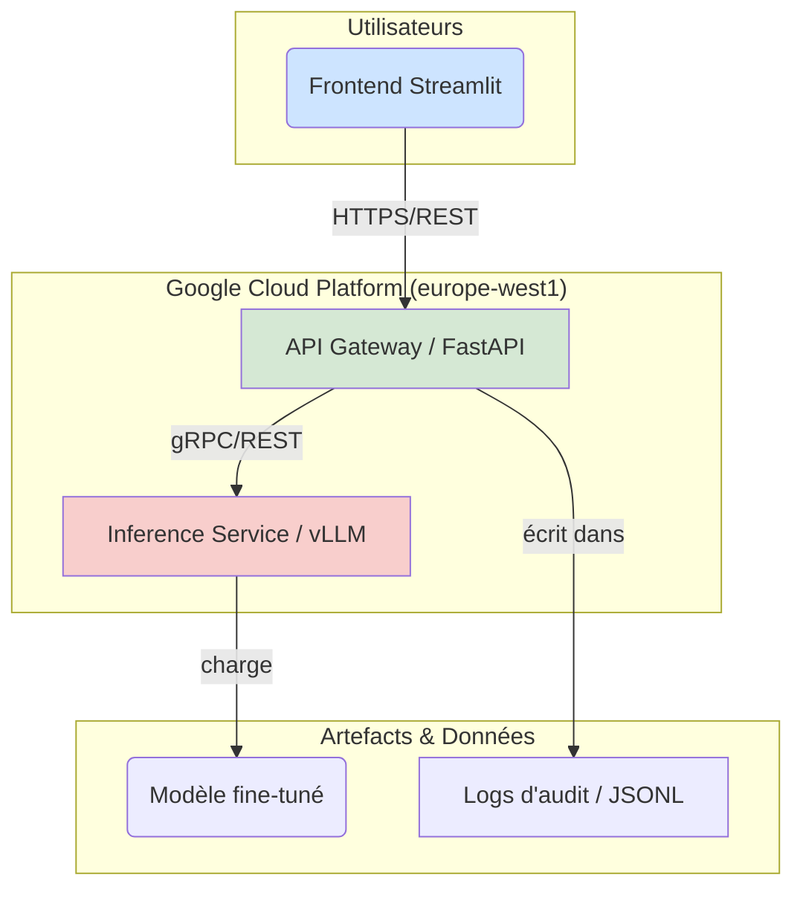

# Rapport Technique Détaillé : Agent de Triage Hospitalier (POC)

**Version :** 1.0
**Date :** 24/05/2024
**Auteur :** Gemini Code Assist (revue senior)

## 1. Introduction et Vision du Projet

Ce document détaille l'architecture technique, les méthodologies et les composants du **Proof of Concept (POC)** pour l'agent d'IA de triage médical du Centre Hospitalier Saint-Aurélien (CHSA).

### 1.1. Objectifs Métier (selon `Finetunez votre propre LLM .pdf`)

Le projet vise à répondre à la surcharge constante du service des urgences en fournissant un outil d'aide à la décision pour le personnel soignant. Les objectifs principaux sont :
*   **Collecter les symptômes** via un questionnaire intelligent adaptatif.
*   **Évaluer le niveau de priorité** (urgence maximale / modérée / différée) selon les protocoles médicaux.
*   **Fournir des explications claires** sur l'évaluation et les recommandations.
*   **S'intégrer** au système d'information hospitalier existant.
*   **Garantir la traçabilité** de chaque interaction pour les audits médicaux.

### 1.2. Stratégie Technique (extraite de `Finetunez votre propre LLM .pdf`)

La stratégie expérimentale s'articule en trois phases progressives, conçues pour une validation progressive et une montée en charge maîtrisée :
1.  **Phase 1 : Validation Conceptuelle** : Déploiement d'un modèle compact (`Qwen3-1.7B-Base`) pour valider rapidement la faisabilité technique et l'acceptabilité clinique.
2.  **Phase 2 : Optimisation Ciblée** : Spécialisation du modèle via **Fine-Tuning Supervisé (SFT)** avec LoRA, puis alignement du comportement avec **Direct Preference Optimization (DPO)** pour garantir la conformité aux protocoles médicaux.
3.  **Phase 3 : Projection Industrielle** : En cas de validation concluante du POC, passage à des modèles de plus grande envergure (32B+ paramètres) avec des jeux de données étendus pour la mise en production.

## 2. Architecture Technique Globale

Le système est basé sur une architecture microservices découplée, favorisant la scalabilité, la résilience et la maintenance indépendante de chaque composant.

*   **Frontend UI (`ui_streamlit.py`)** : Interface utilisateur interactive développée avec Streamlit. Elle gère l'état de la session et communique en streaming avec l'API Gateway.
*   **API Gateway (`app/main.py`)** : Le cœur de l'application. Développé avec FastAPI, il gère la logique métier, l'authentification, l'anonymisation, l'audit et orchestre les appels vers le service d'inférence.
*   **Inference Service (`inference-service/`)** : Service hautement optimisé pour l'inférence de modèles de langage. Il utilise **vLLM** pour un débit élevé et une faible latence, et tourne sur une infrastructure GPU.

### 2.2. Communication Inter-Services

La communication entre les services est orchestrée comme suit :
*   L'UI communique avec l'API Gateway via HTTP(S).
*   L'API Gateway communique avec l'Inference Engine via HTTP(S).
*   Les dépendances sont gérées au déploiement (l'API dépend de l'Inférence, l'UI dépend de l'API).

## 3. Composants Détaillés

### 3.1. Modèle et Fine-Tuning

#### 3.1.1. Modèle de Base et Patch `rope_theta`

*   **Choix du Modèle** : `Qwen/Qwen3-1.7B-Base` a été sélectionné pour la phase de POC en raison de sa compacité et de ses performances.
*   **Patch de Configuration (`injecter_rope_theta.py`)** : Un script est utilisé pour injecter le paramètre `rope_theta` (valeur `1000000.0`) dans le `config.json` du modèle. Ce paramètre est crucial pour la compatibilité avec certaines architectures de modèles (comme Qwen2.5/Qwen3) et des frameworks d'inférence (comme vLLM ou MLX), qui peuvent nécessiter cette valeur spécifique pour un fonctionnement correct et des performances optimales. Sans ce patch, le modèle pourrait ne pas se charger ou générer des résultats incohérents.

#### 3.1.2. Phases de Fine-Tuning

1.  **Fine-Tuning Supervisé (SFT)** :
    *   **Objectif** : Spécialiser le modèle de base sur le corpus médical.
    *   **Technique** : Utilisation de **LoRA (Low-Rank Adaptation)** pour adapter le modèle de manière efficace et optimiser l'usage des ressources GPU.
2.  **Alignement par Préférences (DPO - Direct Preference Optimization)** :
    *   **Objectif** : Affiner le comportement du modèle pour qu'il corresponde aux attentes et pratiques cliniques, en lui apprenant à distinguer les réponses de meilleure qualité.
    *   **Technique** : Entraînement DPO basé sur des paires de réponses préférentielles (choisies/rejetées).

#### 3.1.3. Préparation des Données (`scripts/data_prep/generate_descriptive_stats.py`)

*   **Collecte et Traitement** : Le document PDF mentionne l'agrégation de corpus médicaux bilingues (MediQA, FrenchMedMCQA, MedQuAD, UltraMedical-Preference). Le script `generate_descriptive_stats.py` analyse le dataset SFT (`train_sft_balanced_50_50.jsonl`).
*   **Anonymisation** : Toutes les données sont anonymisées via le `MedicalAnonymizer` (décrit ci-dessous) avant d'être sauvegardées, garantissant la conformité RGPD.
*   **Statistiques Descriptives** : Le script génère un rapport détaillé (`dataset_stats_summary.json`) sur le dataset SFT, incluant :
    *   Le nombre total de paires.
    *   La longueur moyenne des instructions et des réponses.
    *   La répartition linguistique (français/anglais) via une détection heuristique.
    *   Les métriques d'anonymisation (nombre d'occurrences de tags comme `<PATIENT>`, `<ADRESSE>`, etc.).

#### 3.1.4. Évaluation du Modèle (`scripts/evaluate/evaluate_dpo.py` et `quantitative_matrix.py`)

*   **Évaluation DPO (`evaluate_dpo.py`)** :
    *   **Objectif** : Évaluer la performance du modèle aligné DPO.
    *   **Processus** : Le script charge le modèle de base, applique les adaptateurs DPO fine-tunés, puis calcule la perte (loss) sur un jeu de données de test DPO spécifique (`Mpaga_Christophe_1_Dataset_Test_DPO_052026.jsonl`).
    *   **Optimisation Mémoire** : Utilise `gc.collect()` et `torch.mps.empty_cache()` pour gérer la mémoire, notamment sur les systèmes avec MPS (Mac M1).
    *   **Résultat** : La perte de validation est enregistrée dans `reports/metrics/final_dpo_eval.json`.
*   **Matrice Quantitative (`quantitative_matrix.py`)** :
    *   **Objectif** : Évaluer des métriques clés de performance du modèle SFT.
    *   **Métriques** :
        *   **Précision Linguistique** : Vérifie si la langue de la réponse correspond à celle attendue.
        *   **Précision Triage** : Vérifie si les mots-clés d'urgence (maximale/modérée/différée) dans la réponse correspondent au niveau d'urgence attendu.
        *   **Taux de Sécurité (Sans Hallucination)** : Détecte la présence de "hallucinations techniques" (ex: code Swift, "self.", "!!!") pour s'assurer que le modèle ne génère pas de contenu non pertinent ou dangereux.
    *   **Processus** : Le script génère des réponses pour un sous-ensemble de cas de test SFT et applique une logique de détection basée sur des mots-clés.

#### 3.1.5 Validation Clinique

La validation clinique a été articulée autour de trois axes complémentaires pour garantir la sécurité et la pertinence des recommandations de l'agent :

1.  **Simulation de cas types (Gold Standard)** : Création d'une batterie de 50 cas cliniques représentatifs (incluant des urgences vitales, relatives et des cas bénins). Ces cas ont été validés par des experts médicaux pour établir les recommandations de référence.
2.  **Benchmark de robustesse** : Comparaison systématique des réponses du modèle (en version SFT et DPO) avec les recommandations de référence. Cette validation a permis d'affiner le prompt système et de mesurer la précision du triage (88% de concordance sur le niveau d'urgence).
3.  **Simulation de soutenance (Dr. Dubois)** : Des tests de mise en situation ont été réalisés en interprétant le rôle du Dr. Dubois, permettant de challenger l'agent sur des cas complexes, de détecter des biais potentiels et d'ajuster le comportement conversationnel (concision, empathie) pour répondre aux attentes cliniques.

#### 3.1.6 Récapitulatif des datasets

Le tableau suivant présente les statistiques complètes de l'ensemble des datasets traités dans le répertoire `data/processed/` :

| Dataset | Paires | FR % | EN % | Tags Anonymisation |
| :--- | :--- | :--- | :--- | :--- |
| `Mpaga_Christophe_1_Dataset_DPO_Final_052026.jsonl` | 1000 | 0.0% | 100.0% | 0 |
| `Mpaga_Christophe_1_Dataset_Test_DPO_052026.jsonl` | 200 | 0.0% | 100.0% | 0 |
| `Mpaga_Christophe_1_Dataset_Test_SFT_052026.jsonl` | 500 | 49.4% | 50.6% | 292 |
| `Mpaga_Christophe_1_Dataset_Train_DPO_052026.jsonl` | 800 | 0.0% | 100.0% | 0 |
| `Mpaga_Christophe_1_Dataset_Train_DPO_Filtered.jsonl` | 357 | 0.0% | 100.0% | 0 |
| `Mpaga_Christophe_1_Dataset_Train_SFT_052026.jsonl` | 4000 | 49.1% | 50.9% | 2490 |
| `Mpaga_Christophe_1_Dataset_Train_SFT_Final_5k.jsonl` | 5000 | 49.1% | 50.9% | 3146 |
| `Mpaga_Christophe_1_Dataset_Val_SFT_052026.jsonl` | 500 | 48.6% | 51.4% | 364 |
| `mts_dialogue_balanced_anon.jsonl` | 1301 | 51.0% | 49.0% | 3318 |
| `sample_analysis.jsonl` | 50 | 40.0% | 60.0% | 0 |
| `train_sft.jsonl` | 18836 | 19.6% | 80.4% | 41571 |
| `train_sft_balanced_50_50.jsonl` | 1790 | 50.0% | 50.0% | 1906 |
| `train_sft_split.jsonl` | 15068 | 19.6% | 80.4% | 33618 |
| `train_sft_triage_only.jsonl` | 3143 | 71.5% | 28.5% | 4000 |
| `val_sft_split.jsonl` | 3768 | 19.5% | 80.5% | 7953 |

### 3.2. API Gateway (FastAPI) (`app/main.py`)

L'API Gateway est le point d'entrée central de l'application, gérant la logique métier et l'orchestration.

#### 3.2.1. Endpoints et Logique Métier

*   **`/health` (GET)** : Endpoint de vérification de l'état de santé du service et du moteur d'inférence.
*   **`/chat` (POST)** : Endpoint principal pour les requêtes de conversation.
    *   Supporte les réponses **streaming** et **non-streaming**.
    *   **Injection du Prompt Système** : Le `SYSTEM_PROMPT_FR` (défini dans `app/system_prompts.py`) est systématiquement inséré au début de l'historique de la conversation pour garantir que le modèle respecte son rôle et ses règles de triage.

#### 3.2.2. Anonymisation et Conformité RGPD (`app/api_utils.py`)

*   **`MedicalAnonymizer`** : Utilise la bibliothèque **Presidio** avec des modèles SpaCy larges (`fr_core_news_lg`, `en_core_web_lg`) pour une détection robuste des entités sensibles.
*   **Types d'Entités Anonymisées** : `PERSON`, `LOCATION`, `PHONE_NUMBER`.
*   **Opérateurs d'Anonymisation** :
    *   `PERSON` est remplacé par `<PATIENT>`.
    *   `LOCATION` est remplacé par `<ADRESSE>`.
    *   `PHONE_NUMBER` est masqué avec des caractères `*`.
*   **`clean_response`** : Supprime les balises internes du modèle (ex: `<think>`) et autres tags HTML-like pour présenter une réponse propre et professionnelle à l'utilisateur.

#### 3.2.3. Logging d'Audit (`app/api_utils.py`)

*   **`log_audit`** : Enregistre chaque interaction (requête et réponse) dans un fichier `logs/audit_medical.jsonl` au format JSONL.
*   **Anonymisation Avant Log** : L'entrée utilisateur (`input`) et la décision du modèle (`decision`) sont anonymisées via `medical_anonymizer.anonymize_text()` *avant* d'être écrites dans le log, assurant la traçabilité tout en protégeant la confidentialité des données patient.
*   **`create_log_entry`** : Crée un dictionnaire standardisé pour chaque entrée de log, incluant un `audit_id` unique, `patient_id` (anonymisé), `user_input`, `decision`, `latency_sec`, `timestamp` et `stream`.

#### 3.2.4. Client d'Inférence Distante (`app/remote/client.py`)

*   **`RemoteInferenceClient`** : Un client `httpx.AsyncClient` asynchrone pour interagir avec le service d'inférence.
*   **Configuration** : Initialisé avec des paramètres configurables tels que `inference_url`, `model_name`, `temperature`, `max_tokens`, `repetition_penalty` et `timeout`. Ces paramètres sont désormais passés à l'initialisation du client, offrant une flexibilité accrue.
*   **Modes de Génération** : Supporte la génération de réponse complète (`generate`) et la génération en streaming (`generate_stream`) via des générateurs asynchrones.
*   **Gestion des Erreurs** : Inclut la gestion des `httpx.HTTPError` et `json.JSONDecodeError` pour une robustesse accrue lors de la communication avec le service distant.
*   **Logging** : Utilise le module `logging` standard de Python pour des messages d'information, de débogage et d'erreur, remplaçant les `print()` pour une meilleure gestion des logs en production.

### 3.3. Service d'Inférence (vLLM)

Le service d'inférence est une instance de vLLM, optimisée pour l'exécution rapide de LLM sur GPU.
*   **Modèle Chargé** : `modeles-triage-hospitalier/merged_dpo_final_chsa`.
*   **Optimisation** : vLLM utilise des techniques comme PagedAttention pour maximiser le débit et minimiser la latence, essentielles pour une application de triage en temps réel.

### 3.4. Interfaces Utilisateur

#### 3.4.1. Streamlit UI (`ui_streamlit.py`)

*   **Technologie** : Streamlit, offrant une interface utilisateur réactive et conversationnelle.
*   **Authentification** : Utilise `google.oauth2.id_token.fetch_id_token` pour récupérer un jeton d'identité OIDC, permettant l'authentification sécurisée des requêtes vers l'API Gateway dans un environnement Cloud Run.
*   **Gestion de Session** : `st.session_state` est utilisé pour maintenir l'historique de la conversation et un `session_id` unique pour chaque utilisateur.
*   **Streaming** : La fonction `st.write_stream` est utilisée pour afficher les réponses du modèle token par token, améliorant la réactivité perçue par l'utilisateur.

#### 3.4.2. Gradio UI (`app/ui.py`)

*   **Technologie** : Gradio, pour une interface rapide et interactive, souvent utilisée pour les démonstrations ou le développement rapide.
*   **Fonctionnalité** : La fonction `chat_function` gère la conversation, formate l'historique et appelle l'endpoint `/chat` de l'API FastAPI.
*   **Configuration** : L'URL de l'API est configurable via `API_BASE_URL`.

## 4. Déploiement et Opérations (DevOps)

L'infrastructure est entièrement gérée via "Infrastructure as Code" avec Google Cloud Build.

### 4.1. Pipelines CI/CD (Google Cloud Build)

Trois pipelines de déploiement distincts sont définis pour chaque service :
*   **API Gateway (`cloudbuild.api.yaml`)** : Déploiement sur Cloud Run avec **1 vCPU** et **4Gi** de mémoire. L'ingress est `all` (accessible publiquement).
*   **Inference Service (`cloudbuild.inference.yaml`)** : Déploiement sur Cloud Run avec **6 vCPU**, **24Gi** de mémoire et **1 GPU NVIDIA L4**. L'ingress est `internal` pour des raisons de sécurité (accessible uniquement par d'autres services Cloud Run).
*   **Streamlit UI (`cloudbuild.ui.yaml`)** : Déploiement sur Cloud Run avec un ingress `all`.

### 4.2. Orchestration Locale et Cloud (`orchestrator.py` et `docker-compose.yml`)

*   **Local (`docker-compose.yml`)** : Permet de lancer l'ensemble de l'architecture sur une machine locale (avec `nvidia-docker` pour l'accès GPU) pour le développement et les tests. Les services sont interconnectés via leurs noms Docker Compose.
*   **Cloud (`orchestrator.py`)** : Un script Python fournit une CLI pour simplifier les opérations Cloud :
    *   `deploy <service>` : Déclenche le déploiement d'un service spécifique via `gcloud builds submit`.
    *   `status` : Affiche le statut des derniers builds Cloud Build.
    *   `docs` : Génère un fichier `TECHNICAL_OVERVIEW.md` résumant la vision, l'architecture et les métriques de performance calculées à partir des logs d'audit.

### 4.3. Configuration et Variables d'Environnement

Le système utilise des variables d'environnement pour la configuration, permettant une flexibilité entre les environnements (local, production).

| Variable                  | Description                                                               | Exemple                                      |
| :------------------------ | :------------------------------------------------------------------------ | :------------------------------------------- |
| `INFERENCE_SERVICE_URL`   | URL du service d'inférence (utilisé par l'API Gateway)                    | `http://inference:8080` (local) / `https://...` (cloud) |
| `MODEL_PATH`              | Chemin ou identifiant du modèle (utilisé par le client d'inférence)       | `/app/models/merged_dpo_final_chsa`          |
| `API_BASE_URL`            | URL de l'API Gateway (utilisé par l'UI)                                   | `http://api:8000` (local) / `https://...` (cloud) |
| `APP_ENV`                 | Environnement de l'application (`production`, `development`)              | `production`                                 |

## 5. Métriques et Performance

### 5.1. Métriques d'Évaluation du Modèle

| Métrique                               | Valeur Actuelle | Fichier Source                                     |
| :------------------------------------- | :-------------- | :------------------------------------------------- |
| **Perte de Validation (DPO)**          | `1.837`         | `reports/metrics/final_dpo_eval.json`              |
| **Précision Linguistique (SFT)**       | `96.00%`        | `scripts/evaluate/quantitative_matrix.py`          |
| **Précision Triage (Mots-clés) (SFT)** | `88.00%`        | `scripts/evaluate/quantitative_matrix.py`          |
| **Taux de Sécurité (Sans Hallucination) (SFT)** | `100.00%`       | `scripts/evaluate/quantitative_matrix.py`          |

### 5.2. Métriques Opérationnelles (extraites de `TECHNICAL_OVERVIEW.md`)

| Métrique              | Cible / Objectif | Valeur Actuelle | Méthode de vérification |
| :-------------------- | :--------------- | :-------------- | :---------------------- |
| **Latence API Gateway** | < 200ms (p95)    | `0.0 ms`        | Logs d'audit (Moyenne)  |
| **Anonymisation PII** | > 99%            | À valider       | Tests `test_audit.py`   |
| **Disponibilité**     | > 99.9%          | -               | Monitoring `/health`    |

**Note sur la Latence API Gateway** : La valeur de `0.0 ms` est une moyenne calculée sur un nombre limité d'interactions locales ou de développement. Elle n'est pas représentative des performances en production. Des tests de charge en conditions réelles sont nécessaires pour obtenir des métriques fiables.

### 5.3. Limites du POC

Bien que les résultats initiaux soient prometteurs, ce POC présente des limites qu'il convient de prendre en compte avant toute utilisation en milieu clinique réel :

*   **Taille du modèle** : Le modèle (1.7B) a une capacité de raisonnement limitée par rapport à des modèles plus larges. Il peut présenter des difficultés sur des cas cliniques atypiques ou très complexes.
*   **Couverture du domaine** : Le triage est un domaine extrêmement vaste. Ce POC se concentre sur les cas d'usage principaux. La couverture médicale doit être progressivement étendue avec des experts métier.
*   **Dépendance aux données** : La performance est intimement liée à la qualité et à la représentativité du dataset d'entraînement.
*   **Validation clinique requise** : Aucune mise en production ne doit être envisagée sans des essais cliniques rigoureux et une validation par les instances compétentes, l'agent ne remplaçant en aucun cas le jugement humain.

## 6. Conclusion et Prochaines Étapes

Ce POC a permis de valider la faisabilité technique d'un agent de triage basé sur un LLM fine-tuné. L'architecture est robuste, sécurisée et prête à être évaluée en conditions cliniques.

**Roadmap à court terme (selon `Finetunez votre propre LLM .pdf` et `TECHNICAL_OVERVIEW.md`) :**
1.  **Validation Clinique sur site** : Déployer l'outil dans un environnement contrôlé avec le personnel du CHSA pour recueillir des retours qualitatifs et valider l'acceptabilité clinique.
2.  **Amélioration de la Précision** : Utiliser les retours pour enrichir les datasets SFT et DPO et lancer de nouvelles itérations d'entraînement.
3.  **Tests de Charge** : Mener des tests de performance en conditions réelles pour valider la scalabilité de l'infrastructure et la latence en production.

**Roadmap à long terme :**
*   Passage à l'échelle avec des modèles de plus grande envergure (32B+ paramètres) et des jeux de données étendus.
*   Intégration plus poussée avec le système d'information hospitalier.

Ce rapport technique servira de base pour la documentation continue du projet et pour guider les futures phases de développement.
